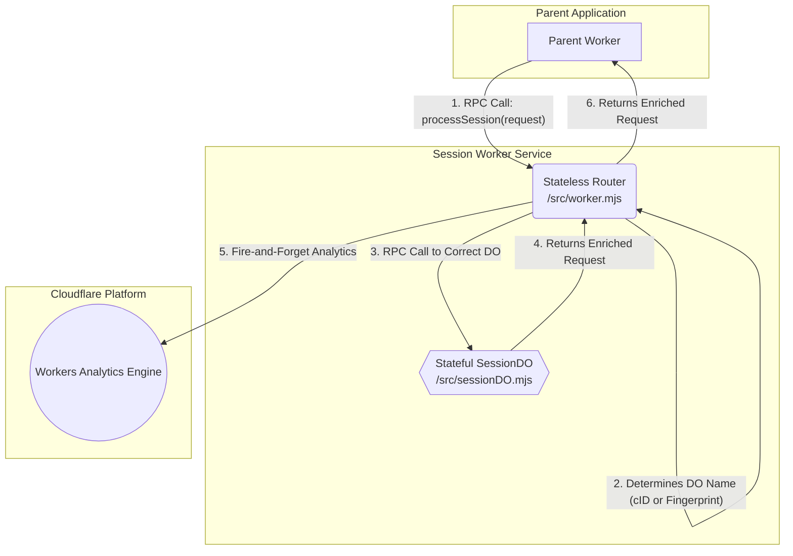

# Architecture & Request Flow

This diagram illustrates the high-level architecture of the `divortio-session-worker` and the lifecycle of a request
from a parent application.

The system is designed with a clear separation of concerns:

1. The **Parent Application** is the consumer and only needs to know about the single RPC endpoint.
2. The **Session Worker Service** encapsulates all the complex logic.
    * The **Stateless Router** (`worker.mjs`) acts as the resilient entry point, handling routing and analytics.
    * The **Stateful SessionDO** (`sessionDO.mjs`) is the single source of truth for a user's session state, handling
      all storage and business logic.
3. The **Cloudflare Platform** provides the underlying services like the Workers Analytics Engine.

