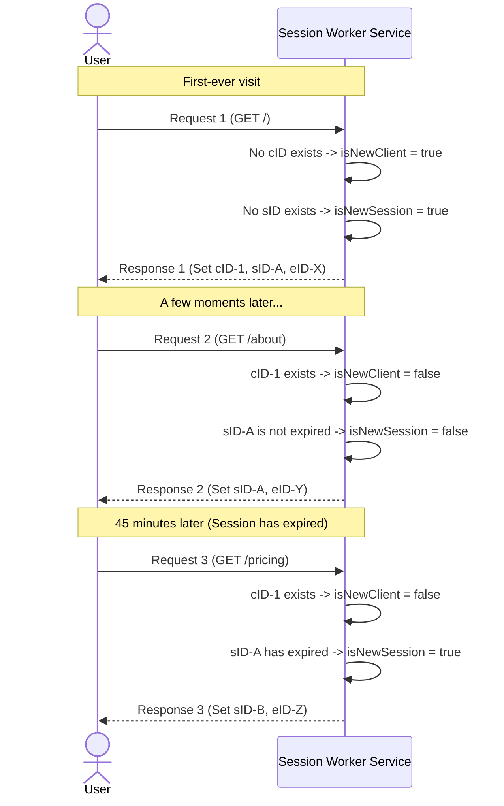

# Session & Identifier Lifecycle

This diagram illustrates the lifecycle of the three core identifiers (`cID`, `sID`, `eID`) for a single user over
multiple requests. It shows how the system maintains a long-term identity while creating ephemeral sessions and events.

The identifiers follow a "waterfall" model:

* **`cID` (Client ID)**: Created only once on the user's first-ever visit. It is the most persistent identifier and
  represents the user's long-term identity.
* **`sID` (Session ID)**: Created on the user's first visit and then again only after a period of inactivity (e.g., 30
  minutes). It groups together a series of events from a single browsing session.
* **`eID` (Event ID)**: A new `eID` is generated for every single request. It is the most granular identifier and is
  used to mark the user's last activity time.

