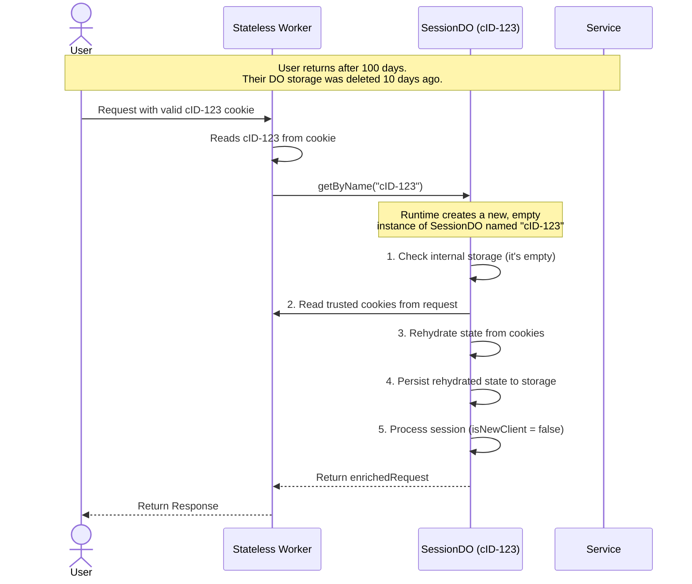

# State Rehydration Flow

This diagram explains the "Trust and Rehydrate" model, which is a critical feature for the service's long-term
resilience and efficiency. It illustrates what happens when a returning user with a valid `cID` cookie makes a request
after their original Durable Object's storage has been deleted by the TTL garbage collection alarm.

The key steps are:

1. The stateless worker correctly identifies the user by their `cID` cookie and locates their DO by name.
2. The Cloudflare runtime creates a new, empty instance of the `SessionDO` since the old one was deleted.
3. The new DO instance checks its own storage and finds it empty.
4. It then **trusts the `HttpOnly, Secure` cookies** from the request to "rehydrate" its state, writing the session data
   back to its persistent storage.
5. The session continues seamlessly, and the user is correctly identified as a returning client, not a new one.

This pattern allows the service to be both cost-effective (by deleting stale data) and robust (by never losing a user's
long-term identity).

