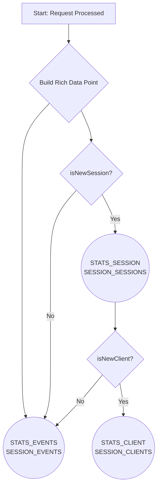

# Multi-Dataset Analytics Model

This diagram explains the "Multi-Dataset" strategy used by the `divortio-session-worker` to provide efficient, powerful
analytics.

Instead of writing every event to a single large table, the worker first prepares a single, rich data point. It then
uses conditional logic based on the session's state (`isNewClient`, `isNewSession`) to send that data point to the
appropriate specialized dataset(s).

This approach makes querying for key metrics, such as new client acquisition, significantly faster and more
cost-effective.

